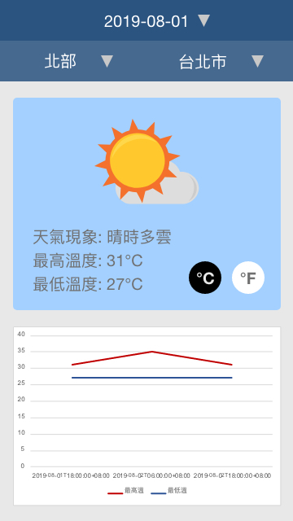
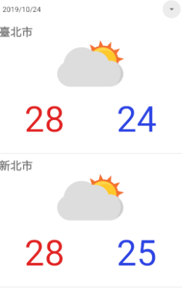
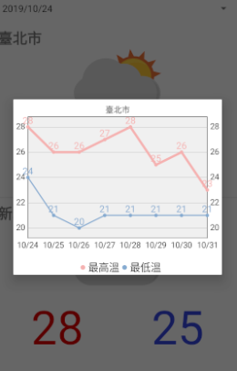

# android-weather

## environment

- [Android Studio 3.5.1](https://developer.android.com/studio)
- Java jdk 1.8.0_152, Kotlin 1.3.31
- emulator Pixel_2_API_29

## 資料來源
- [氣象資料開放平台 - 一週縣市天氣預報](https://opendata.cwb.gov.tw/dataset/forecast/F-C0032-005)

## XD Prototype

## 畫面

